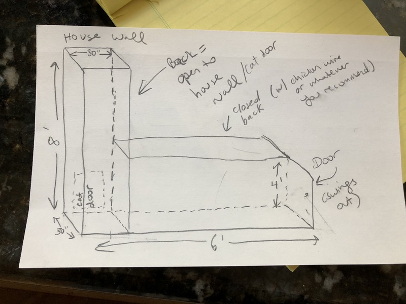
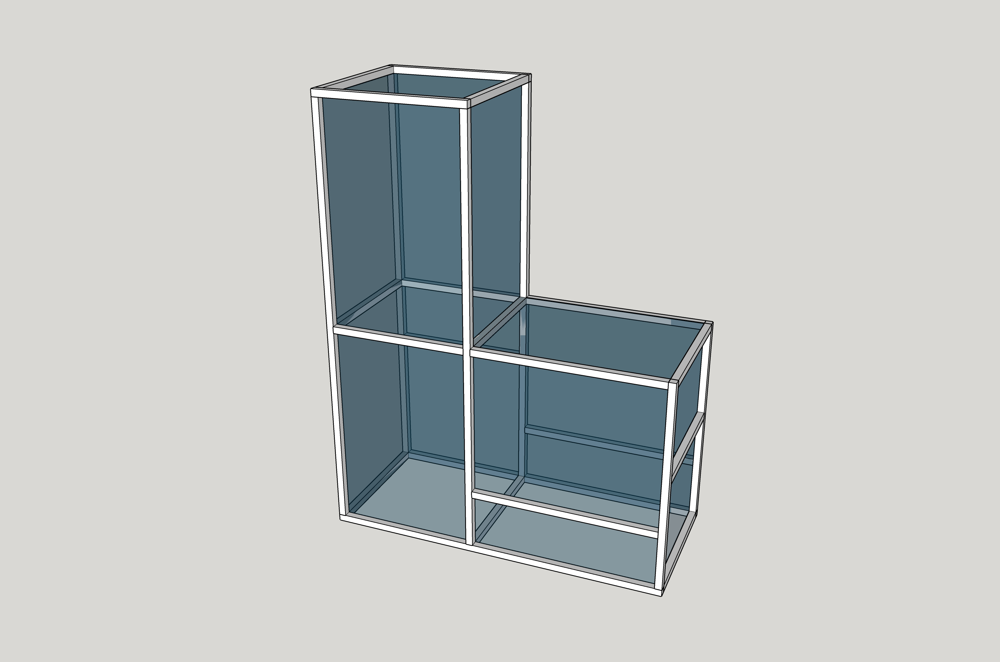
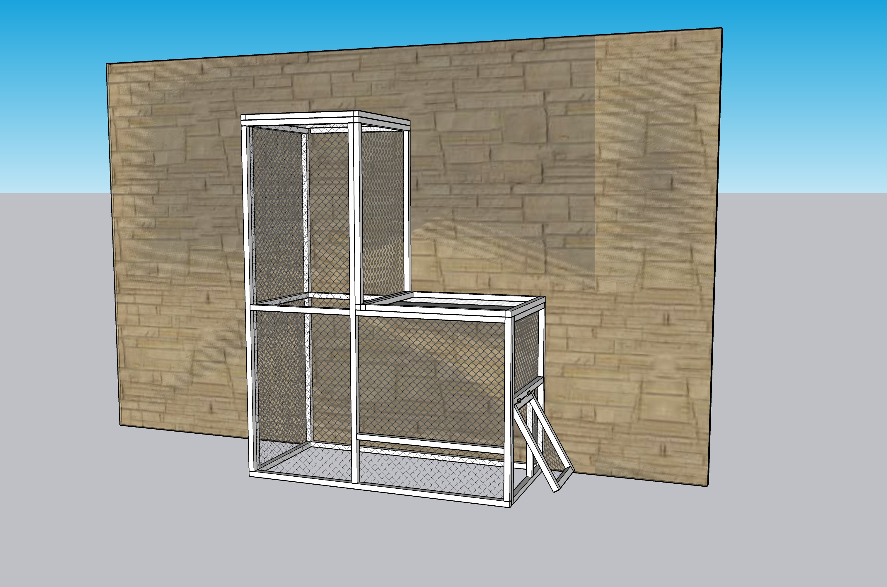

# Catio notes

Material

* Galvanized 1/2"x1/2" to 2” x 3” grid-opening fencing wire (depends on how you want it to look)
* 2x2 wooden boards (8' long)
* Boards for shelves

## Ideas

* https://catiospaces.com/catios-cat-enclosures/
* https://purrfectlyhomey.com/2018/11/the-catio

## Draft

Here's the image with dimensions from Maya:

## Design sketch v1.0

**Problem:** hard to build. **Solution:** Turn into panels (front, side, and back panels). Also, there's no door to the right yet.

## Design sketch v1.1

Updated design has 6 panels.

* 1 front panel
* 3 side panels
* 2 top panels

