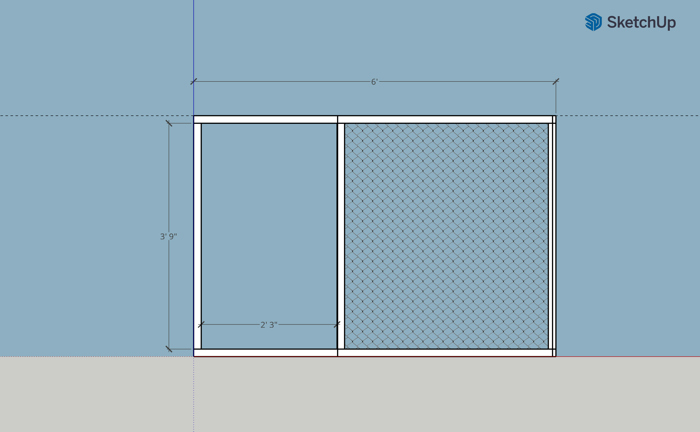
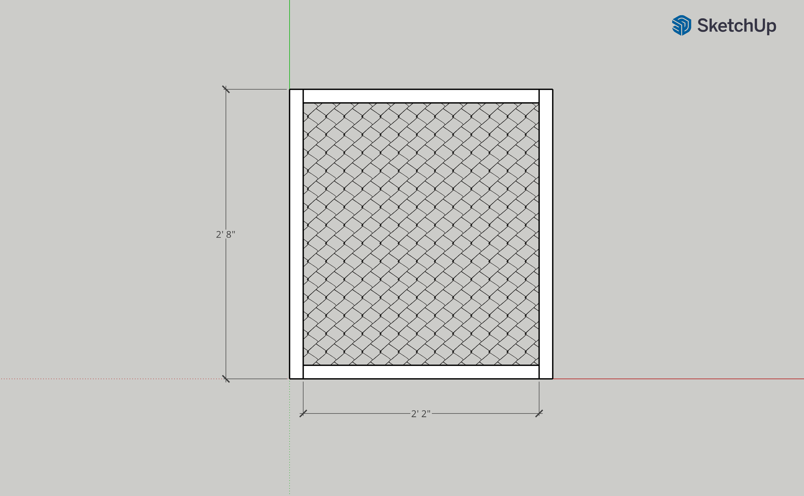
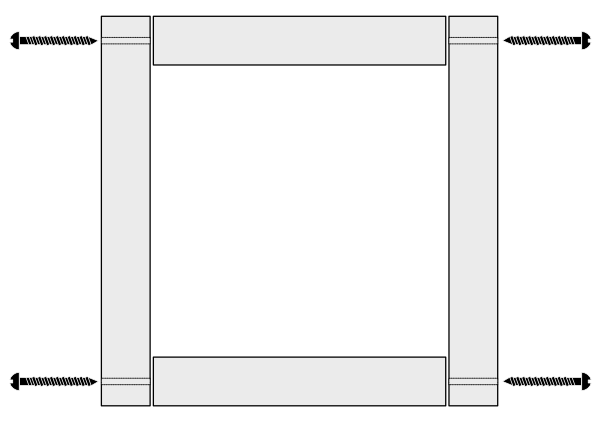

# Catio notes

Material

* Galvanized 1/2"x1/2" to 2” x 3” grid-opening fencing wire (depends on how you want it to look)
* 2x2 wooden boards (8' long)
* Boards for shelves

## Ideas

* https://catiospaces.com/catios-cat-enclosures/
* https://purrfectlyhomey.com/2018/11/the-catio

## Draft

Here's the image with dimensions from Maya:

**Placement:**

## Design sketch v1.0

**Problem:** hard to build. **Solution:** Turn into panels (front, side, and back panels). Also, there's no door to the right yet.

## Design sketch v1.1

Updated design has 6 panels.

* 1 front panel
* 3 side panels
* 2 top panels

## Design Sketch v1.2

**Further simplified:** 

* lower and top box are constructed separately
* 6 different panel types (each type has the same dimensions) make up the whole catio. 10 panels total. (2 panels have hinged doors.)

The top cage could be lifted off, if attached with some kind of pin and hook system, for example.

An exploded view shows that panel type A (28x48'') makes up almost all of the top part, and is used once in the lower part. 

# Individual panel dimensions

## Panel A

To make cutting and clamping easier, the panel has been slightly updated so that all horizontal pieces have the same length (26 inches).

## Panel B (with door)

Panel B is basically Panel A with a small door.

## Panel C

Panel C is comprised of a large rectangular frame, with a small door at the lower left.

## Panel D

Panel D faces the wall, and has an opening to the cat door that leads inside the house.

## Panel E

Panel E is the lower top cover.

## Panel F

The topmost cover panel.

 

# Screw placement

I'd probably drill some pilot holes, so that the screws hit the rectangular face of the lumber right in the middle. (Also, less chance of the wood splitting.) The better the 90-degree cuts of the 2x2s are, the easier it will be to get a frame that's also rectangular.

